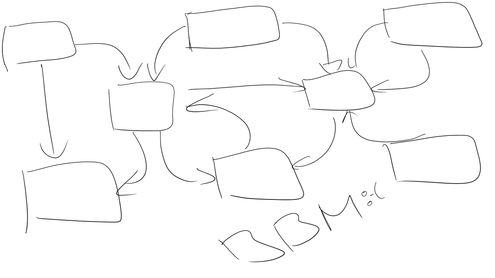
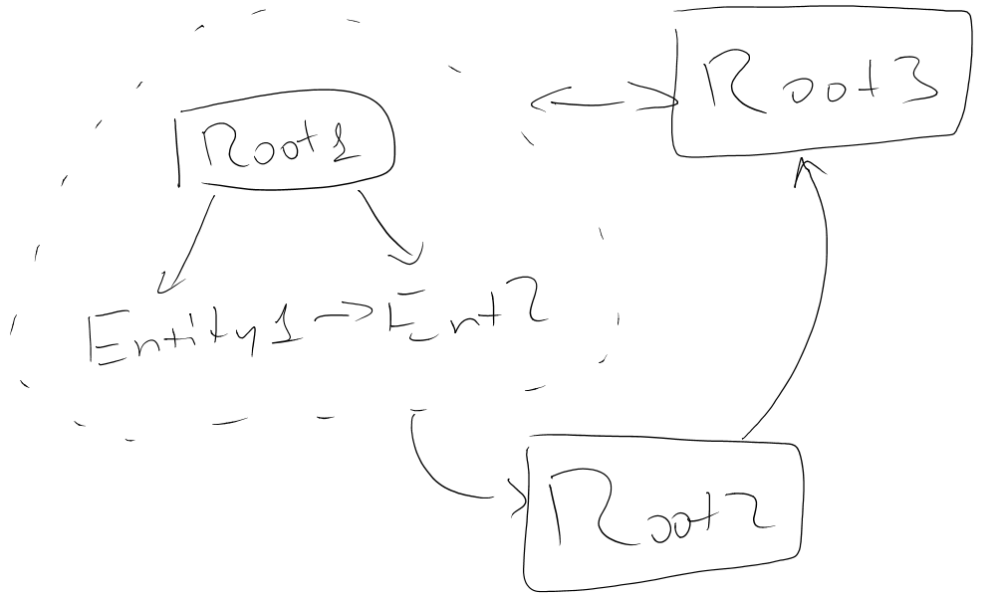
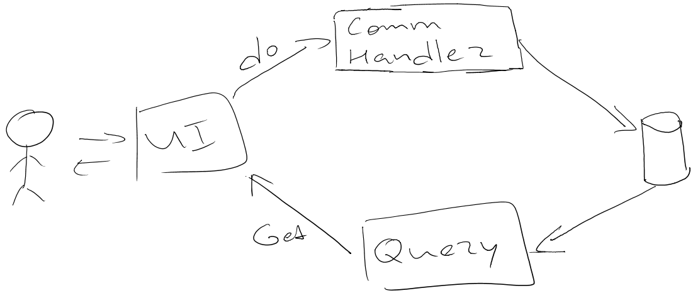
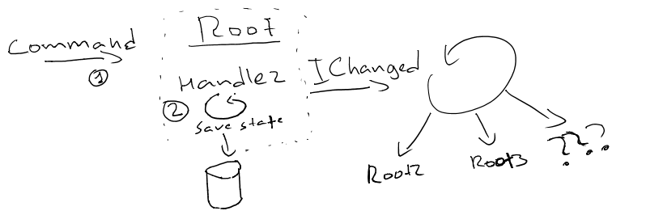
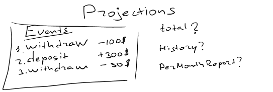
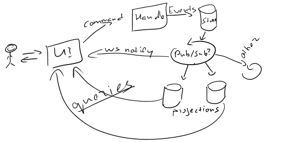

- title : DDD CQRS/ES
- description : Introduction to CQRS/ES
- author : Alexander Prooks 
- theme : night
- transition : default

***

### (Functional) Architecture Patterns

***
### Domain Driven Design

- проблемно-ориентированное проектирование
- Набор принципов для упрощения реализации сложной предметной области

---
#### DDD

- **Ubiquous language ** - общий язык
- Контекст каждой подсистемы, со своим языком
- Aggregate root, вместо частных сущностей

[и много чего ещё ](http://en.wikipedia.org/wiki/Domain-driven_design)

---
#### FROM

---

#### TO

***

### CQRS

- Command Query Responsibility Segregation
- Разделение ответсвенности между командами и запросами

- **Command** - запрос поменять состояние
- **Query** - запрос предоставить данные

---

#### Самый простой CQRS

- Бёрем REST
- GET = query
- POST, PUT, DELETE etc меняет, но отдает только OK || ERROR

---

#### Зачем городить дальше?

- Потеря семантики 
- PUT /DOCUMENT/1  ????? подписать, закрыть, отменить?

---

#### CQRS + DDD

- Даем **Командам** значимые имена: Create, SignUp, UpdateProfile etc
- Получатели ответсвенны за обработку уже внутри модели

- (Нас не волнует, но) Простой Scale Out 

= Profit!

Amazon API

    https://ec2.amazonaws.com/?Action=AttachVolume
    &VolumeId=vol-4d826724
    &InstanceId=i-6058a509
    &Device=/dev/sdh
    &AUTHPARAMS

---

#### Basic CQRS

---

#### Complex Domain

---

#### C# псевдокод

    [lang=cs]
    public class UpdateEmail { public string Email {get;set;} }

    public class UserProfile{

        public void Handle(UpdateEmail command){

            var profile = UserRepository.Load();
            profile.Email = command.Email;

            UserRepository.Save(this);
            Bus.Publish(new EmailUpdated(profile));  //publish event            
        }
    }

    public class Notifier{
        public void Handle(EmailUpdated userProfile){
            MailService.SendEmailConfirmation(
                userProfile.Email );
        }
    }
***

### ES

---

### Core

    [lang=fs]
    //HandleCommand:
    handler:  Command -> State ->  Event

    //UpdateState
    apply: Event -> State -> State

    type State = {
        Name:string //всё, что меняется
    }
    with
        static member Zero = {Name=""}

---

#### Customer

    [lang=fs]
    type State = {
        name : string
        email: string
    }
    with 
        static member Zero = {name=""; email=""}

    type Commands = 
    | Create of string*string
    | UpdateEmail of string
    // | UpdateName of string 
    // | ShipLicense of string*int 
    // | etc

---
#### Handler

    [lang=fs]
    type Events = 
    | Created of string*string    
    | UpdatedEmail of string

    let exec state = 
        function 
        | Create (name, email) ->
            if state<> State.Zero then failwith "Not new"
            Created(name,email)
        | UpdateEmail email->
            if state = State.Zero then failwith "Customer is not yet created"
            UpdatedEmail(email)
---

#### Handling in Infrastructure

    [lang=fs]
    // load загрузка событий
    // commit сохранение     
    let handler load commit (id, command) =
        let history = load id
        let aggregate = MAGIC history
        let event = exec aggregate command
        commit id event
---
#### !!MAGIC!!

    [lang=fs]
    let apply state = 
        function
        | Created (name,email) -> 
            { state with State.name = name; State.email = email}
        | UpdatedEmail email ->
            { state with State.email = email}

    let customer = Created("tester", "test@ex.com")
                   |>apply State.Zero 

    let ver2     = UpdatedEmail("super_test@ex.com")
                   |> apply customer
---
#### MOARRR

    [lang=fs]
    let history = [
                    Created("tester", "test@ex.com")
                    UpdatedEmail("super_test@ex.com")]

    let state = history |> Seq.fold apply State.Zero

    (*
    val state : State = {name = "tester";
                     email = "super_test@ex.com";}
    *)

***

---

    [lang=fs]
    let totalProjection prev event = 
        match event with
        | Withdrawal amount -> prev - amount
        | Deposit amout -> prev + amount

    let historyProjection prev = 
        match event with
        | Withdrawal amount -> prev @ "Withdrawn " + amount
        | Deposit amout -> prev @ "Deposit " + amount

---

***

### Profit?!

- История неменяемая
- Легко добавить новые проекции
- Нет проблем с оптимизациями
- Если накосячили в продакшене - просто перестраиваем заново
- Нормализованная БД = сложная проекция
- Легко повторить любой баг

---
### Cons

- Нельзя хакнуть в продакшене
- Система компенсаций для неверных ивентов
- Тяжело воткнуть

***

### Resources

- Greg Young || Rinat Abdulling

- http://abdullin.com/post/event-sourcing-projections/
- http://abdullin.com/post/event-sourcing-aggregates/

- http://gorodinski.com/blog/2013/02/17/domain-driven-design-with-fsharp-and-eventstore/

- https://github.com/eulerfx/DDDInventoryItemFSharp
- https://github.com/aprooks/eventsourcing :)

---
### Infrastructure

- https://github.com/NEventStore/NEventStore
    - (no) Sql persistence adapter
    
- http://geteventstore.com/
    - JS projections
    - HTTP && .Net API

***

###Example serviceStack

***

### The Reality of a Developer's Life 

**When I show my boss that I've fixed a bug:**
  

  
**When your regular expression returns what you expect:**
  

  
*from [The Reality of a Developer's Life - in GIFs, Of Course](http://server.dzone.com/articles/reality-developers-life-gifs)*

